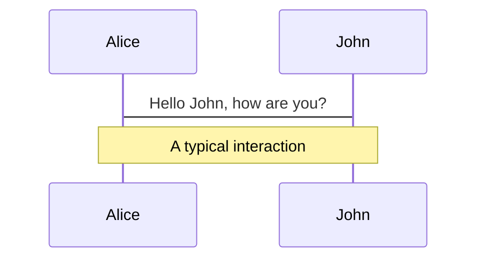
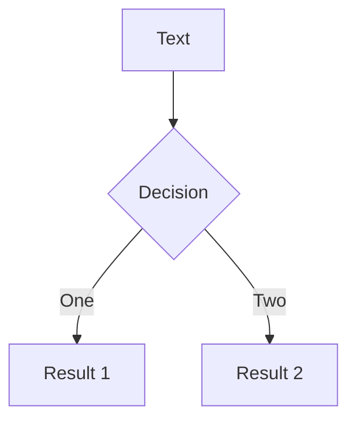
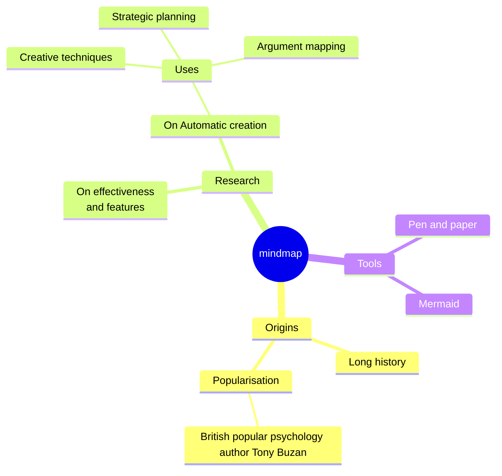
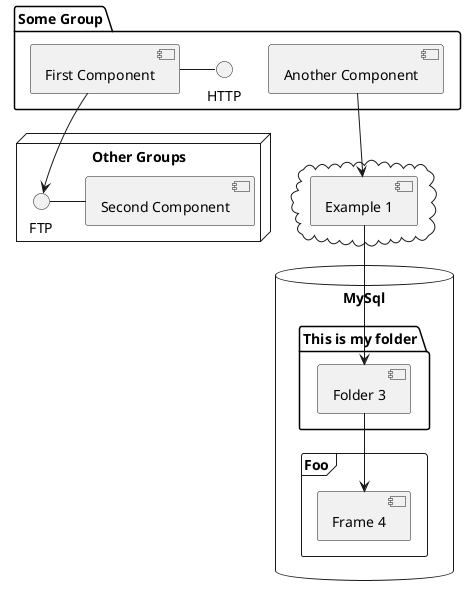

---
# You can also start simply with 'default'
theme: seriph
# random image from a curated Unsplash collection by Anthony
# like them? see https://unsplash.com/collections/94734566/slidev
# background: https://cover.sli.dev
background: /home.jpg
# 网页的标题模板，`%s` 会被页面的标题(title)替换。默认值是 %s - Slidev
titleTemplate: '%s'
# some information about your slides (markdown enabled)
title: 陈磊的 Web PPT
info: |
  ## Slidev Starter Template
  Presentation slides for developers.

  Learn more at [Sli.dev](https://sli.dev)
# apply unocss classes to the current slide
class: text-center
# https://sli.dev/features/drawing
drawings:
  persist: false
# slide transition: https://sli.dev/guide/animations.html#slide-transitions
transition: slide-left
# enable MDC Syntax: https://sli.dev/features/mdc
mdc: true
# take snapshot for each slide in the overview
overviewSnapshots: true # TODO 暂时没有明白什么意思
---

# 第四季度技术分享

<div class="abs-br m-6 flex gap-2">
  <a href="https://github.com/chenlei0608/slide-quarter-4" target="_blank" alt="GitHub" title="GitHub 地址"
    class="text-xl slidev-icon-btn opacity-50 !border-none !hover:text-white">
    <carbon-logo-github />
  </a>
  <a href="https://chenlei0608.github.io/blog/" target="_blank" alt="GitHub" title="陈磊的博客"
    class="text-xl slidev-icon-btn opacity-50 !border-none !hover:text-white">
    <carbon:earth-americas-filled />
  </a>
</div>


---
layout: two-cols
hideInToc: true
---

# 目录

::right::

<Toc v-click minDepth="1" maxDepth="1" columns="1" class="toc-class" />

<style>
.toc-class {}
h1 {
  margin-top: 200px;
  margin-left: 100px;
}
</style>


---
transition: fade-out
---

# 什么是 Slidev ？

Slidev 是一个为开发者设计的幻灯片制作和演示工具，具有以下特点：

- 📝 [**Markdown 支持**](https://cn.sli.dev/guide/syntax.html) —— 使用你最喜欢的编辑器和工作流编写 Markdown 文件
- 🧑‍💻 [**对开发者友好**](https://cn.sli.dev/guide/syntax.html#code-blocks) —— 内置代码高亮、实时编码等功能
- 🌈 [**灵活样式**](https://cn.sli.dev/guide/syntax.html#embedded-styles) —— 使用 [Windi CSS](https://windicss.org/) 按需使用的实用类和易用的内嵌样式表
- 🤹 [**交互**](https://cn.sli.dev/custom/directory-structure.html#components) —— 无缝嵌入 Vue 组件
- 🎙 [**演示者模式**](https://cn.sli.dev/guide/presenter-mode.html) —— 可以使用另一个窗口，甚至是你的手机来控制幻灯片
- 📰 [**图表支持**](https://cn.sli.dev/guide/syntax.html#diagrams) —— 使用文本描述语言创建图表
- 🌟 [**图标**](https://cn.sli.dev/guide/syntax.html#icons) —— 能够直接从任意图标库中获取图标
- 🎥 [**录制**](https://cn.sli.dev/guide/recording.html) —— 内置录制功能和摄像头视图
- 📤 [**跨平台**](https://cn.sli.dev/guide/exporting.html) —— 能够导出 PDF、PNG 文件，甚至是一个可以托管的单页应用
- ⚡️ [**快速**](https://vitejs.dev) —— 基于 [Vite](https://vitejs.dev) 的即时重载
- 🛠 [**可配置**](https://cn.sli.dev/custom/config-vite.html) —— 支持使用 Vite 插件、Vue 组件以及任何的 npm 包
<br>

阅读更多关于 [为什么选择 Slidev？](https://sli.dev/guide/why)

<style>
h1 {
  background-color: #2B90B6;
  background-image: linear-gradient(45deg, #4EC5D4 10%, #146b8c 20%);
  background-size: 100%;
  -webkit-background-clip: text;
  -moz-background-clip: text;
  -webkit-text-fill-color: transparent;
  -moz-text-fill-color: transparent;
}
</style>


---
transition: fade-out
---

# Slidev 技术栈

Slidev 基于以下工具和技术构建：

- [**Vite**](https://vitejs.dev) - 一款极速响应的下一代的前端工具链
- [**Vue 3**](https://v3.vuejs.org/) powered [**Markdown**](https://daringfireball.net/projects/markdown/syntax) - 用于编写幻灯片内容
- [**UnoCSS**](https://github.com/unocss/unocss) - 帮助快速构建幻灯片样式
- [**Shiki**](https://github.com/shikijs/shiki), [**Monaco Editor**](https://github.com/Microsoft/monaco-editor) - 为在幻灯片中嵌入代码提供一流支持
- [**RecordRTC**](https://recordrtc.org) - 内置的录制工具和摄像头视图
- [**VueUse**](https://vueuse.org) 系列 - [`@vueuse/core`](https://github.com/vueuse/vueuse), [`@vueuse/head`](https://github.com/vueuse/head), [`@vueuse/motion`](https://github.com/vueuse/motion), 等等
- [**Iconify**](https://iconify.design/) - 用图标集丰富你的幻灯片
- [**Drauu**](https://github.com/antfu/drauu) - 用于在幻灯片上绘图和批注
- [**KaTeX**](https://katex.org/) - 用于渲染 LaTeX 数学公式
- [**Mermaid**](https://mermaid-js.github.io/mermaid) - 基于文本的图表绘制工具


---
transition: fade-out
---

# 快速上手

<v-switch>
<template #1>
<br>
在终端运行以下命令来创建一个新的 Slidev 项目：

<br>

```sh
npm init slidev@latest # npm

pnpm create slidev # pnpm

yarn create slidev # yarn
```

<br>
<br>

根据指引，输入项目名称并按照提示完成项目创建。幻灯片内容在 slides.md 文件中，初始内容包含了 Slidev 的大部分功能的演示。
</template>

<template #2>
  <div style="display: flex; justify-content: center;">
    
  </div>
</template>
</v-switch>


---
transition: fade-out
---

# 语法 --- Frontmatter 和 Headmatter

在每张幻灯片的开头，你可以添加一个可选的 frontmatter 来配置幻灯片。第一个 frontmatter 块称为 headmatter，可以配置整个幻灯片集。其余的是用于单个幻灯片的 frontmatters

```md
---
theme: seriph
title: Welcome to Slidev
---

# 第一页

第一页的 frontmatter 也是整个演示文稿的 headmatter

---
layout: center
background: /background-1.png
---

# 第二页

本页的布局是 `center`，背景是一张图片
```


---
transition: fade-out
---

# 语法 --- 备注

每张幻灯片的末尾的注释块（若有），将被视为幻灯片的备注。它们将在用户界面中显示，以供您在演示过程中参考

```md
---
layout: cover
---

# 第一页

封面页

<!-- 这是一段备注 -->

```


---
transition: slide-up
---

# 语法 --- 代码块

```ts {all|1|3-4|6|all} twoslash
import { computed, ref } from 'vue'

const count = ref(0)
const doubled = computed(() => count.value * 2)

doubled.value = 2

// 无论代码块的第一行代码代码是什么位置，行号都是从1开始
// 显示步骤：1全部代码高亮 2第一行代码高亮 3第三至第四行代码高亮 4第六行代码高亮 5全部代码高亮
```

<arrow v-click="[3, 4]" x1="350" y1="190" x2="155" y2="235" color="#953" width="2" arrowSize="1" />

[了解更多](https://cn.sli.dev/guide/syntax#code-block)


---
transition: slide-up
---

# 内置组件 --- Arrow

绘制一个箭头。

```md
<Arrow x1="10" y1="20" x2="100" y2="200" />
```

参数：

- `x1` (`string | number`, 必要值): 起始 x 位置
- `y1` (`string | number`, 必要值): 起始 y 位置
- `x2` (`string | number`, 必要值): 终点 x 位置
- `y2` (`string | number`, 必要值): 终点 y 位置
- `width` (`string | number`, 默认为: `2`): 线宽
- `color` (`string`, 默认为: `'currentColor'`): 颜色
- `two-way` (`boolean`, default: `false`): draw a two-way arrow


---
layout: two-cols
transition: slide-up
---

# 内置组件 --- Toc

<div v-click="[1, 2]" style="margin-top: 170px; margin-right: 30px;">
  <div style="margin-bottom: 20px;">
    使用方式：
  </div>


  ```md
  <Toc />
  ```
</div>

::right::

示例：

<Toc mode="onlyCurrentTree" />


---
transition: slide-up
level: 2
---

# 导航

将鼠标悬停在左下角以查看导航控制面板，[了解更多](https://cn.sli.dev/guide/ui#navigation-bar)

## 键盘快捷键

|     |     |
| --- | --- |
| <kbd>右</kbd> / <kbd>空格</kbd>| 下一个动画或幻灯片 |
| <kbd>左</kbd>  / <kbd>Shift</kbd><kbd>空格</kbd> | 上一个动画或幻灯片 |
| <kbd>上</kbd> | 上一张幻灯片 |
| <kbd>下</kbd> | 下一张幻灯片 |


<p v-after class="absolute bottom-23 left-45 opacity-30 transform -rotate-10">这儿!</p>


---
level: 2
---

# Shiki Magic Move

Powered by [shiki-magic-move](https://shiki-magic-move.netlify.app/), Slidev supports animations across multiple code snippets.

Add multiple code blocks and wrap them with <code>````md magic-move</code> (four backticks) to enable the magic move. For example:

````md magic-move {lines: true}
```ts {*|2|*}
// step 1
const author = reactive({
  name: 'John Doe',
  books: [
    'Vue 2 - Advanced Guide',
    'Vue 3 - Basic Guide',
    'Vue 4 - The Mystery'
  ]
})
```

```ts {*|1-2|3-4|3-4,8}
// step 2
export default {
  data() {
    return {
      author: {
        name: 'John Doe',
        books: [
          'Vue 2 - Advanced Guide',
          'Vue 3 - Basic Guide',
          'Vue 4 - The Mystery'
        ]
      }
    }
  }
}
```

```ts
// step 3
export default {
  data: () => ({
    author: {
      name: 'John Doe',
      books: [
        'Vue 2 - Advanced Guide',
        'Vue 3 - Basic Guide',
        'Vue 4 - The Mystery'
      ]
    }
  })
}
```

Non-code blocks are ignored.

```vue
<!-- step 4 -->
<script setup>
const author = {
  name: 'John Doe',
  books: [
    'Vue 2 - Advanced Guide',
    'Vue 3 - Basic Guide',
    'Vue 4 - The Mystery'
  ]
}
</script>
```
````

---

# Components

<div grid="~ cols-2 gap-4">
<div>

You can use Vue components directly inside your slides.

We have provided a few built-in components like `<Tweet/>` and `<Youtube/>` that you can use directly. And adding your custom components is also super easy.

```html
<Counter :count="10" />
```

<!-- ./components/Counter.vue -->
<Counter :count="10" m="t-4" />

Check out [the guides](https://sli.dev/builtin/components.html) for more.

</div>
<div>

```html
<Tweet id="1390115482657726468" />
```

<Tweet id="1390115482657726468" scale="0.65" />

</div>
</div>

<!--
Presenter note with **bold**, *italic*, and ~~striked~~ text.

Also, HTML elements are valid:
<div class="flex w-full">
  <span style="flex-grow: 1;">Left content</span>
  <span>Right content</span>
</div>
-->

---
class: px-20
---

# Themes

Slidev comes with powerful theming support. Themes can provide styles, layouts, components, or even configurations for tools. Switching between themes by just **one edit** in your frontmatter:

<div grid="~ cols-2 gap-2" m="t-2">

```yaml
---
theme: default
---
```

```yaml
---
theme: seriph
---
```


</div>

Read more about [How to use a theme](https://sli.dev/guide/theme-addon#use-theme) and
check out the [Awesome Themes Gallery](https://sli.dev/resources/theme-gallery).

---

# Clicks Animations

You can add `v-click` to elements to add a click animation.

<div v-click>

This shows up when you click the slide:

```html
<div v-click>This shows up when you click the slide.</div>
```

</div>

<br>

<v-click>

The <span v-mark.red="3"><code>v-mark</code> directive</span>
also allows you to add
<span v-mark.circle.orange="4">inline marks</span>
, powered by [Rough Notation](https://roughnotation.com/):

```html
<span v-mark.underline.orange>inline markers</span>
```

</v-click>

<div mt-20 v-click>

[Learn more](https://sli.dev/guide/animations#click-animation)

</div>

---

# Motions

Motion animations are powered by [@vueuse/motion](https://motion.vueuse.org/), triggered by `v-motion` directive.

```html
<div
  v-motion
  :initial="{ x: -80 }"
  :enter="{ x: 0 }"
  :click-3="{ x: 80 }"
  :leave="{ x: 1000 }"
>
  Slidev
</div>
```

<div class="w-60 relative">
  <div class="relative w-40 h-40">
    
    
    
  </div>

  <div
    class="text-5xl absolute top-14 left-40 text-[#2B90B6] -z-1"
    v-motion
    :initial="{ x: -80, opacity: 0}"
    :enter="{ x: 0, opacity: 1, transition: { delay: 2000, duration: 1000 } }">
    Slidev
  </div>
</div>

<!-- vue script setup scripts can be directly used in markdown, and will only affects current page -->
<script setup lang="ts">
const final = {
  x: 0,
  y: 0,
  rotate: 0,
  scale: 1,
  transition: {
    type: 'spring',
    damping: 10,
    stiffness: 20,
    mass: 2
  }
}
</script>

<div
  v-motion
  :initial="{ x:35, y: 30, opacity: 0}"
  :enter="{ y: 0, opacity: 1, transition: { delay: 3500 } }">

[Learn more](https://sli.dev/guide/animations.html#motion)

</div>

---

# LaTeX

LaTeX is supported out-of-box. Powered by [KaTeX](https://katex.org/).

<div h-3 />

Inline $\sqrt{3x-1}+(1+x)^2$

Block
$$ {1|3|all}
\begin{aligned}
\nabla \cdot \vec{E} &= \frac{\rho}{\varepsilon_0} \\
\nabla \cdot \vec{B} &= 0 \\
\nabla \times \vec{E} &= -\frac{\partial\vec{B}}{\partial t} \\
\nabla \times \vec{B} &= \mu_0\vec{J} + \mu_0\varepsilon_0\frac{\partial\vec{E}}{\partial t}
\end{aligned}
$$

[Learn more](https://sli.dev/features/latex)

---

# Diagrams

You can create diagrams / graphs from textual descriptions, directly in your Markdown.

<div class="grid grid-cols-4 gap-5 pt-4 -mb-6">









</div>

Learn more: [Mermaid Diagrams](https://sli.dev/features/mermaid) and [PlantUML Diagrams](https://sli.dev/features/plantuml)

---
foo: bar
dragPos:
  square: 691,32,167,_,-16
---

# Draggable Elements

Double-click on the draggable elements to edit their positions.

<br>

###### Directive Usage

```md

```

<br>

###### Component Usage

```md
<v-drag text-3xl>
  <carbon:arrow-up />
  Use the `v-drag` component to have a draggable container!
</v-drag>
```

<v-drag pos="663,206,261,_,-15">
  <div text-center text-3xl border border-main rounded>
    Double-click me!
  </div>
</v-drag>


###### Draggable Arrow

```md
<v-drag-arrow two-way />
```

<v-drag-arrow pos="67,452,253,46" two-way op70 />

---
src: ./pages/imported-slides.md
hide: false
---

---

# Monaco Editor

Slidev provides built-in Monaco Editor support.

Add `{monaco}` to the code block to turn it into an editor:

```ts {monaco}
import { ref } from 'vue'
import { emptyArray } from './external'

const arr = ref(emptyArray(10))
```

Use `{monaco-run}` to create an editor that can execute the code directly in the slide:

```ts {monaco-run}
import { version } from 'vue'
import { emptyArray, sayHello } from './external'

sayHello()
console.log(`vue ${version}`)
console.log(emptyArray<number>(10).reduce(fib => [...fib, fib.at(-1)! + fib.at(-2)!], [1, 1]))
```


---
layout: cover
---

想象一个场景：同事a和同事b因某种原因共用一个开发分支 feature，同事a写了一堆代码，提交了一次代码，同事b此时也写了一堆代码，也要提交一次代码。

如果稍不注意，提交历史就会不那么好看了，这种历史记录包含了多个分叉点和合并提交，就会导致 git 提交历史看起来非常混乱


---
layout: cover
---

git pull = git fetch + git merge，在执行 git pull 时，其实是有一步合并操作的


---
layout: cover
---

# 解决办法1

每次 add 前先执行 pull，如果有冲突，本地解决冲突，然后提交（如果在commit后，另外有一个同事就在此时提交代码到远程仓库了，此方法是不能保证线性提交历史的）

上文说到 git pull 其实是有 merge 操作的，那这样为什么可以保证线性提交历史呢？原因：

1. 没有冲突的情况下是会默认执行了快进合并，此时不会强制创建合并提交历史的
2. 即使有冲突，此时还没有 commit 操作，解决冲突后，执行 add 和 commit 操作，还是会只有一次提交记录


---
layout: cover
---

# 解决办法2(终极解决办法)

使用 git pull --rebase

```sh {all|1-2|3|4|5-9|all} twoslash
git add .
git commit -m "新增一行打印（1）"
git push
# error
git pull --rebase
# 处理冲突
git commit -m "新增一行打印（2）"
git rebase --continue
git push
```


---


---
layout: center
class: text-center
---

# 谢谢！
